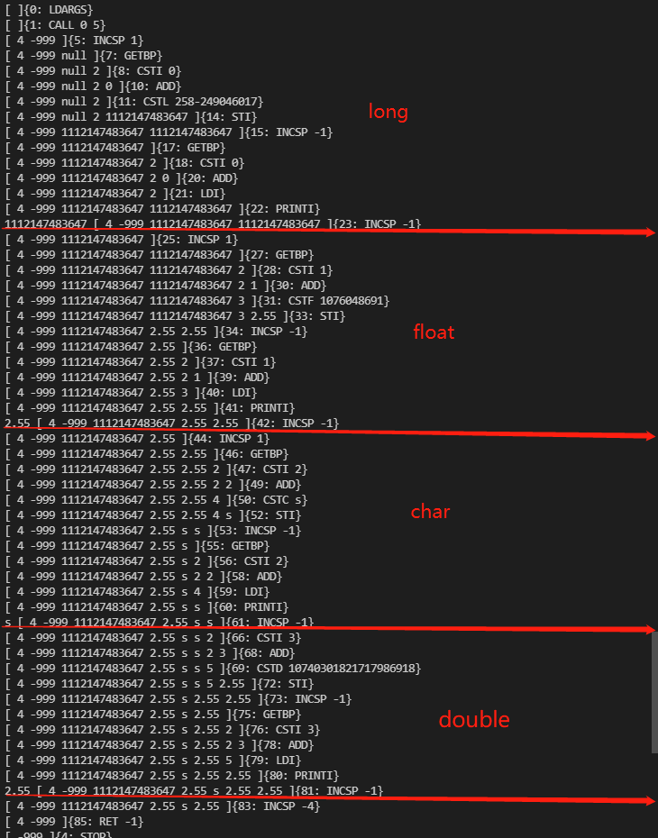
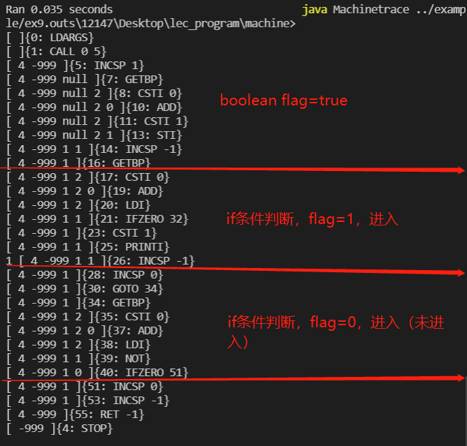
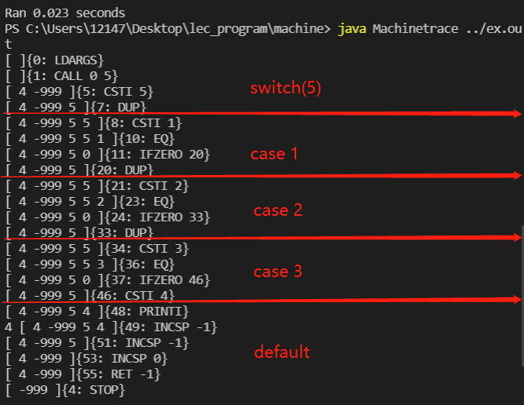
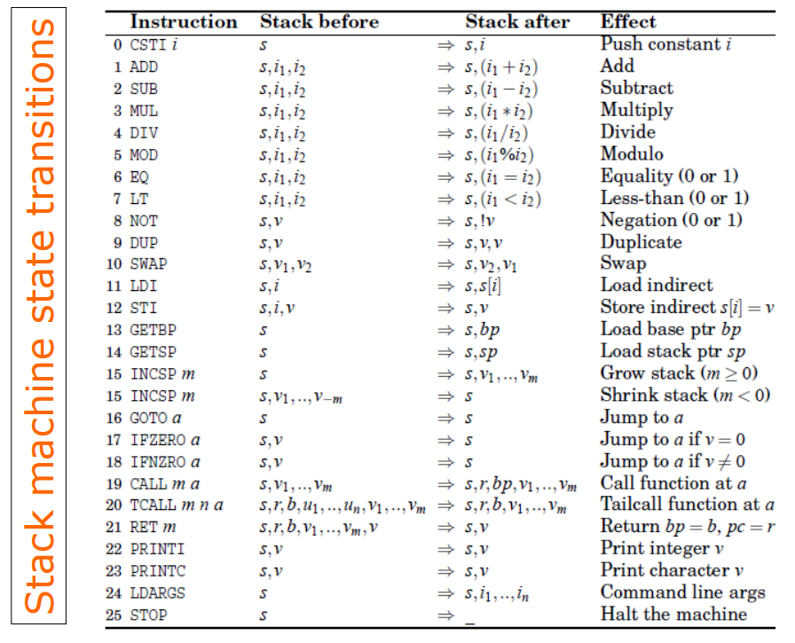

2020-2021学年第2学期 实 验 报 告


- 课程名称：编程语言原理与编译
- 实验项目：<u>MicroC</u>
- 专业班级：计算机1803
- 学生学号：31801135，31801137
- 学生姓名：潘嘉辉，王哲文
- 实验指导教师: 张芸
- [编译原理期末大作业 (github)](https://github.com/YeQiuO/lec_program)


## 简介

这是一个名为MicroC的编译原理大作业，主要基于microC和Yuby完成，通过对解释器和编译器的代码改进和开发，实现了部分C语言的语法(并改进了部分)。主要完成功能如下：


## 项目说明

### 结构

- `CLex.fsl`生成的`CLex.fs`词法分析器。

  + CLex 中定义了基本的关键字、标识符、常量、使用大写字母表示

    程序读到这个符号就会转换为我们定义的大写字母，然后就给 CPar 处理

- `CPar.fsy`生成的`CPar.fs`语法分析器。

  + CPar 文件分为两部分，每个部分之间通过 %% 分隔

  + 第一部分声明需要使用的变量(词元)，声明变量后还需要声明优先级

  + 第二部分定义语法规则(文法)

    包括 : statement ,expression ,function  ,main ,vardeclare   variabledescirbe ,type ,const这些基本元素

    表示识别到前面定义的这些大写字母组成的符号串后,怎么处理这些规则

- `Absyn.fs` 定义了抽象语法树

  定义了变量描述、函数和类型的构造方法

- `Comp.fs`将抽象语法树转化为栈式虚拟机

- `interp.fs`对抽象语法树进行语义分析

- `Machine.fs` 虚拟机指令定义

- `Machine.java` 执行虚拟机指令

+ `Machine.java`生成`Machine.class`虚拟机与`Machinetrace.class`堆栈追踪

测试集：测试程序放在example文件夹内


### 使用方法

#### 编译器

**生成汇编指令数字文件 .out (任选以下两文件之一)**

```js
dotnet restore  microc.fsproj // 可选
dotnet clean  microc.fsproj   // 可选
dotnet build  microc.fsproj   // 构建 ./bin/Debug/net5.0/microc.exe

dotnet run -p microc.fsproj example/ex1.c    // 执行编译器，编译 ex1.c，并输出  ex1.out 文件
dotnet run -p microc.fsproj -g example/ex1.c  // -g 查看调试信息
```

**虚拟机的构建与运行**

```java
javac -encoding UTF-8 Machine.java
java Machine ex9.out 3//直接显示结果    
java Machinetrace ex9.out 0//查看栈式虚拟机每一步的细节
```


在实际使用中发现，如果不加-encoding UTF-8，会造成编辑提示错误。


#### 解释器

**运行编译解释器  interpc.exe **

```js
dotnet restore  interpc.fsproj   // 可选
dotnet clean  interpc.fsproj     // 可选
dotnet build -v n interpc.fsproj // 构建 ./bin/Debug/net5.0/interpc.exe
```

**执行解释器**

```
./bin/Debug/net5.0/interpc.exe ex_all.c
dotnet run -p interpc.fsproj ex_all.c
dotnet run -p interpc.fsproj ex_all.c  //-g 显示token AST 等调试信息
```


## 功能实现

#### 1.变量初始化

- 简介:  变量声明后同时可以初始化变量的值

- 语法分析:

  ```F#
  | Vardec ASSIGN Expr SEMI StmtOrDecSeq { DecAndAssign (fst $1, snd $1, $3) :: $5 }
  ```

- 抽象语法树:

  ```F#
  | DecAndAssign of typ * string * expr
  ```

- 语义分析(解释器):

  ```F#
  and stmtordec stmtordec locEnv gloEnv store =
      match stmtordec with
      | Stmt stmt -> (locEnv, exec stmt locEnv gloEnv store)
      | Dec (typ, x) -> allocate (typ, x, None) locEnv store
      | DecAndAssign (typ, name, expr) -> allocate (typ, name, Some(fst (eval expr locEnv gloEnv store))) locEnv store
  ```
  
- 编译器:

  ```F#
  and cStmtOrDec stmtOrDec (varEnv: VarEnv) (funEnv: FunEnv) : VarEnv * instr list =
      match stmtOrDec with
      | Stmt stmt -> (varEnv, cStmt stmt varEnv funEnv)
      | Dec (typ, x) -> allocateWithMsg Locvar (typ, x) varEnv
      | DecAndAssign (typ, x, e) -> //定义时赋值
          let (varEnv, code) = allocate Locvar (typ, x) varEnv
  
          (varEnv,
           code
           @ (cExpr (Assign((AccVar x), e)) varEnv funEnv)
             @ [ INCSP -1 ])
  ```
  
- 例子:

  ```c
  void main(){
      int a = 3;
      print a;
  }
  ```

- 堆栈图

  

  


#### 2.float|double类型（解释器）

- 简介:  

  float：单精度浮点型，识别格式为'数字'+'.'+'数字'+'f(F)'，在栈中占一个地址单位

  double：双精度浮点型，识别格式为'数字'+'.'+'数字'，通过iee754转化为64位二进制，拆分成两个32位二进制数后再转化为两个十进制，在栈中占两个地址单位

- 语法分析:

  ```F#
  | ConstFloat                          { CstF $1             }
  | ConstDouble                         { CstD $1             }
  
  ConstFloat:                                              
      CSTFLOAT                            { $1       }
    | MINUS CSTFLOAT                      { - $2     }
  ;
  
  ConstDouble:                                            
      CSTDOUBLE                           { $1       }
    | MINUS CSTDOUBLE                     { - $2     }
  ;
  
  | FLOAT                               { TypF     }
  | DOUBLE                              { TypD     }
  ```

- 抽象语法树:

  ```F#
  | TypF
  | TypD
  | CstF of float
  | CstD of double
  ```

- 语义分析(解释器):

  ```F#
  // memData
      | FLOAT of float
      | DOUBLE of double
  
      member this.float =
          match this with
          | FLOAT i -> i
          | INT i -> float i
          | DOUBLE i -> float i
          | STRING i -> float i
          | _ -> failwith ("wrong float")
  
      member this.double = 
          match this with
          | DOUBLE i -> i
          | INT i -> double i
          | _ -> failwith ("wrong double")
  
  | CstF i -> (FLOAT(i), store)
  | CstD i -> (DOUBLE(i), store)
  ```

- 例子:

  ```c
  void main() {
      double i = 2.21;
      print i;
  
      float j = 3.21;
      print j;
  }
  ```


#### 3.float|double|long|char（编译器）

+ 简介：

  float：单精度浮点型，识别格式为'数字'+'.'+'数字'+'f(F)'，通过IEEER32.24转化为32位二进制，在栈中占一个地址单位

  double：双精度浮点型，识别格式为'数字'+'.'+'数字'，通过IEEE R64.53转化为64位二进制，拆分成两个32位二进制数后再转化为两个十进制，在栈中占两个地址单位

  long：长整型，识别格式为'数字'+'l(L)'，通过字节运算拆分成两个32位，交给虚拟机处理，在栈中占两个地址单位

  char：字符型，识别格式为'''+'字符'+''，在栈中占一个地址单位

+ 例子：

  ```c
  //ex4.c
  void main() {
      
      long a = 100000L;
      print(a);
      
      float b = 2.55F;
      print(b);
  
      char c = 's';
      print(c);
      
      double d = 3.666;
      print(d);
  
  }
  ```

  （参照int类型改进）

  添加一个新类型要在Machine.fs中添加对应的汇编指令、机器码、获得标签在机器码中的地址、得到标签所在地址的函数、反编译等内容。

  在java虚拟机中，在Instruction.java中添加对应指令。

  在Machine.java中根据指令类型，对数据类型进行压栈、加减乘除、判断大小等内容的补充。

+ 堆栈图

  

  float：1076048691，转化为二进制就是2.55的IEEER32.24（IEEE 754)二进制码

  double：1074030182 1717986918，前一个数和后一个数分别转化为32位二进制，拼接起来就是2.55的IEEE R64.53二进制码

  

#### 4.boolean（编译器）

+ 简介：boolean类型，true为1，false为0

+ 词法定义:

  ```F#
  | "boolean" -> BOOLEAN
  | "true"    -> CSTBOOL 1
  | "false"   -> CSTBOOL 0
  ```

+ 语法分析:

  ```F#
  | BOOLEAN                             { TypB }   //=
  ```

+ 抽象语法树:

  ```F#
  | TypB (*boolean*)
  
  Const:
      CSTINT                              { $1       }
    | CSTBOOL                             { $1       }
  ```

+ 例子

  ```c
  void main() {
      boolean flag=true;
      if (flag) {
          print(1);
      }
      if (!flag) {
          print(0);
      }
  }
  ```

+ 堆栈图

  

  

#### 5.string类型（解释器）

- 简介: 字符串类型, 本项目中将其限定为64位字符串

- 语法分析:

  ```F#
  | ConstString                         { CstS $1             }
  
  ConstString:                                           
    CSTSTRING                           { $1       }
  ;
  
  | STRING                              { TypS     }
  ```

- 抽象语法树:

  ```F#
  | TypS
  | CstS of string
  ```

- 语义分析(解释器)::

  ```F#
  // memData
      | STRING of string
  
      member this.string = 
          match this with
          | STRING i -> i
          | INT i -> string i
          | CHAR i -> string i
          | POINTER i -> string i
          | FLOAT i -> string i
          | DOUBLE i -> string i
  
  | CstS i -> (STRING(i), store)
  ```

- 例子:

  ```c
  void main() {
      string i = "编译原理";
      print i;
  }
  ```


#### 6.print

- 简介: 拓展了 print 的功能，可以输出新增的三种类型（string float double）

- 语义分析:

  ```c
  | Prim1 (ope, e1) ->
          let (i1, store1) = eval e1 locEnv gloEnv store
  
          let res =
              match ope with
              | "!" -> if i1.int = 0 then INT(1) else INT(0)
              | "printi" ->
                  if i1 = STRING(i1.string) then
                      printf "%s " i1.string
                      i1 
                  else if i1.float = float(i1.int) then 
                      printf "%d " i1.int 
                      i1 
                  else 
                      printf "%.2f " i1.float 
                      i1 
              | "printc" ->
                  printf "%c " i1.char
                  i1
              | _ -> failwith ("unknown primitive " + ope)
  ```
  
- 例子:

  ```c
  同上方 float double string 的例子
  ```
  


#### 7.for

- 简介:  类似于 C 的 for 循环

- 语法分析:

  ```F#
  | FOR Access IN RANGE LPAR Expr COMMA Expr COMMA Expr RPAR StmtM {ForIn($2, $6, $8, $10, $12)}
  ```
  
- 抽象语法树:

  ```F#
  | For of expr * expr * expr * stmt 
  ```

- 语义分析(解释器):

  ```F#
  | For(e1,e2,e3,body) ->
      let (v, store1) = eval e1 locEnv gloEnv store
      let rec loop store1 = 
      let (v,store2) = eval e2 locEnv gloEnv store1
      if v<>INT(0) then loop(snd(eval e3 locEnv gloEnv (exec body locEnv gloEnv store2)))
      else store2
  
      loop store1
  ```

- 语义分析(编译器):

  先编译e1赋值，赋值后释放计算时占用的空间，然后进行条件判断e2，若IFNZRO=1执行body语句，相反结束for循环。

  ```F#
  | For(e1, e2, e3, body) ->         
        let labbegin = newLabel()
        let labtest  = newLabel()
  
        cExpr e1 varEnv funEnv @ [INCSP -1]
              @ [GOTO labtest; Label labbegin] 
                  @ cStmt body varEnv funEnv
                      @ cExpr e3 varEnv funEnv @ [INCSP -1]
                          @ [Label labtest] 
                              @ cExpr e2 varEnv funEnv 
                                  @ [IFNZRO labbegin]
  ```

- 例子:

  ```c
  void main() {
      int i;
      for (i = 0; i < 5; i = i + 1)
      {
          print i;
      }
  }
  ```

- 运行时堆栈：

  
  
  

#### 8.do while|do until

- 简介: 

  dowhile：先执行一次body中的语句, 不符合条件跳出循环。

  dountil：先执行一次body中的语句, 符合条件跳出循环.

- 语法分析:

  ```F#
  | DO StmtM WHILE LPAR Expr RPAR SEMI  { DoWhile($2, $5)      }
  
  | DO StmtM UNTIL LPAR Expr RPAR SEMI  { DoUntil($2, $5)      }
  ```
  
- 抽象语法树:

  ```F#
  | DoWhile of stmt * expr
  
  | DoUntil of stmt * expr
  ```

- 语义分析(解释器):

  ```F#
  | DoWhile (body, e) ->
          let rec loop store1 =
              let (v, store2) = eval e locEnv gloEnv store1
              if v <> INT(0) then
                  loop (exec body locEnv gloEnv store2)
              else
                  store2
  
          loop (exec body locEnv gloEnv store)
  
  | DoUntil (body, e) -> 
          let rec loop store1 =
              let (v, store2) = eval e locEnv gloEnv store1
              if v = INT(0) then 
                  loop (exec body locEnv gloEnv store2)
              else 
                  store2    
  
          loop (exec body locEnv gloEnv store)
  ```

- 语义分析(编译器):

  dowhile：与while相似，只需要将body语句第一次执行一遍后即可

  dountil：与dowhile的区别就是dowhile是条件为1则继续进行，而dountil是条件为1则退出循环

  ```F#
  | DoWhile (body, e) ->
          let labbegin = newLabel ()
          let labtest = newLabel ()
  
          cStmt body varEnv funEnv
              @[ GOTO labtest]
                  @[Label labbegin ] 
                  @ cStmt body varEnv funEnv
                  @ [ Label labtest ] 
                  @ cExpr e varEnv funEnv 
                  @ [ IFNZRO labbegin ] 
                  
  | DoUntil (body, e) ->
          let labbegin = newLabel ()
          let labtest = newLabel ()
  
          cStmt body varEnv funEnv
              @[ GOTO labtest] 
                  @[Label labbegin ] 
                  @ cStmt body varEnv funEnv
                  @ [ Label labtest ] 
                  @ cExpr e varEnv funEnv  
                  @ [ IFZERO labbegin ]
  ```

- 例子:

  ```c
  //ex7.c
  void main() {
      int i=3;
      do{
          i+=1;
      }while(i<3);
      print(i);
      do{
          i-=1;
      }until(i<3);
      print(i);
  }
  ```

- 运行时堆栈：

  
  
  


#### 9.三目运算符 : 

- 简介: 类似于 C 的三目运算符：a > b ? a : b

- 语法分析:

  ```F#
  | Expr QUEST Expr COLON Expr          { Prim3($1,$3,$5)     }
  ```
  
- 抽象语法树:

  ```F#
  | Prim3 of expr * expr * expr
  ```

- 语义分析(解释器):

  ```F#
  | Prim3(e1, e2, e3) ->
          let (v, store1) = eval e1 locEnv gloEnv store
          if v <> INT(0) then eval e2 locEnv gloEnv store1
          else eval e3 locEnv gloEnv store1
  ```

- 语义分析(编译器):

  先编译右值表达式e，判断条件，如果为0，执行e2；如果为1，执行e1。

  ```F#
  | Prim3 (e, e1, e2)    -> 
          let labelse = newLabel ()
          let labend = newLabel ()
          cExpr e varEnv funEnv 
          @ [ IFZERO labelse ] 
            @ cExpr e1 varEnv funEnv 
              @ [ GOTO labend ]
                @ [ Label labelse ]
                  @ cExpr e2 varEnv funEnv 
                    @ [ Label labend ] 
  ```

- 例子:

  ```c
  void main() {
      int i=3;
      i > 5 ? i=0 : i=5;
      print(i);
  }
  ```

- 运行时堆栈：

  


#### 10.+=  -=  *=  /= %=

- 简介: 类似于C. 变量对自身作四则运算.

- 语法分析:

  ```F#
  | Access PLUSASSIGN Expr              { AssignPrim("+=", $1, $3) }
  | Access MINUSASSIGN Expr             { AssignPrim("-=", $1, $3) }
  | Access TIMESASSIGN Expr             { AssignPrim("*=", $1, $3) }
  | Access DIVASSIGN Expr               { AssignPrim("/=", $1, $3) }
  | Access MODASSIGN Expr               { AssignPrim("%=", $1, $3) }
  ```
  
- 抽象语法树:

  ```F#
  | AssignPrim of string * access * expr
  ```

- 语义分析(解释器):

  ```F#
  | AssignPrim(ope, acc, e) ->
          let (loc,store1) = access acc locEnv gloEnv store
          let tmp = getSto store1 loc.pointer
          let (res,store2) = eval e locEnv gloEnv store1
          let num = 
              match ope with
              | "+=" -> 
                  match (tmp) with
                  | INT i -> INT(tmp.int + res.int)
                  | FLOAT i -> FLOAT(tmp.float + res.float)
                  | _ -> failwith ("wrong calu")
              | "-=" -> 
                  match (tmp) with
                  | INT i -> INT(tmp.int - res.int)
                  | FLOAT i -> FLOAT(tmp.float - res.float)
                  | _ -> failwith ("wrong calu")
              | "*=" -> 
                  match (tmp) with
                  | INT i -> INT(tmp.int / res.int)
                  | FLOAT i -> FLOAT(tmp.float / res.float)
                  | _ -> failwith ("wrong calu")
              | "/=" -> 
                  match (tmp) with
                  | INT i -> INT(tmp.int / res.int)
                  | FLOAT i -> FLOAT(tmp.float / res.float)
                  | _ -> failwith ("wrong calu")
              | "%=" -> 
                  match (tmp) with
                  | INT i -> INT(tmp.int % res.int)
                  | FLOAT i -> FLOAT(tmp.float % res.float)
                  | _ -> failwith ("wrong calu")
              | _  -> failwith("unkown primitive " + ope)
          (num, setSto store2 loc.pointer num)
  ```

- 语义分析(编译器):

  首先取得变量e1的位置，DUP一份后取值，再编译右值表达式e2，最后match操作进行加减乘除后赋值。

  ```F#
  | AssignPrim (ope, e1, e2) ->
          cAccess e1 varEnv funEnv
            @[DUP;LDI]
               @ cExpr e2 varEnv funEnv
                  @ (match ope with
                      | "+=" -> [ ADD;STI ]
                      | "-=" -> [ SUB;STI ]
                      | "*=" -> [ MUL;STI ]
                      | "/=" -> [ DIV;STI ]
                      | _ -> raise (Failure "unknown AssignPrim"))
  ```

- 例子:

  ```c
  void main() {
      int i = 3;
      i += 1;
      print(i);
  
      i -= 1;
      print(i);
  
      i *= 2;
      print(i);
  
      i = i/2;
      print(i);
  }
  ```

- 运行时堆栈：

  
  
  
  
  

#### 11.switch-case-default

- 简介: 类似于C. 根据switch中的变量表达式, 找到相同的case值, 若全都不符合, 则执行default中的表达式, 且default表达式必须写在最后.

- 语法分析:

  ```F#
  | FOR LPAR Expr SEMI Expr SEMI Expr RPAR StmtU { For($3, $5, $7, $9) }
  
  CaseList:
                                          { []                   }
    | CaseDec                             { [$1]                 }
    | CaseDec CaseList                    { $1 :: $2             }
    | DEFAULT COLON StmtM                 { [Default($3)]        }
  
  CaseDec:
      CASE Expr COLON Stmt                { Case($2,$4)          }
  ```
  
- 抽象语法树:

  ```F#
  | Switch of expr * stmt list
  | Case of expr * stmt
  | Default of stmt 
  ```

- 语义分析(解释器):

  ```F#
  	| Switch(e, body) ->
          let (v, store0) = eval e locEnv gloEnv store
          let rec carry list = 
              match list with
              | Case(e1, body1) :: next -> 
                  let (v1, store1) = eval e1 locEnv gloEnv store0
                  if v1 = v then exec body1 locEnv gloEnv store1
                  else carry next
              | Default(body) :: over ->
                  exec body locEnv gloEnv store0
              | [] -> store0
              | _ -> store0
  
          (carry body)
  
      | Case (e, body) -> exec body locEnv gloEnv store
      
      | Default(body) -> exec body locEnv gloEnv store
  ```

- 语义分析(编译器):

  定义递归函数serchcases，用来匹配cases这个list，分空集，Case和Default三种情况处理。Case需要进行条件判断，EQ相等才执行body语句，否则再次调用函数寻找下一个。Default则直接执行语句后结束。

  ```F#
  | Switch (e, cases) ->
          let rec searchcases c =
              match c with
              | Case (e, body) :: tail ->
                  let labend = newLabel ()
                  let labfin = newLabel ()
  
                  [DUP]
                    @ cExpr e varEnv funEnv
                      @ [EQ]
                        @ [ IFZERO labend ]
                          @ cStmt body varEnv funEnv
                            @ [ GOTO labfin ]
                              @ [ Label labend ]
                                @ searchcases tail
                                  @ [ Label labfin ]
              | Default body :: [] ->
                  cStmt body varEnv funEnv
              | [] -> []
  
          cExpr e varEnv funEnv 
            @ searchcases cases
              @[INCSP -1]
  ```

- 例子:

  ```c
  void main() {
      switch(5){
          case 1:print(1);
          case 2:print(2);
          case 3:print(3);
          default:print(4);
      }
  }
  ```
  
- 运行时堆栈：

  


#### 12.自增 自减

- 语法分析:

  ```F#
  | Access PREINC                       { Prim4("I++", $1)     } 
  | Access PREDEC                       { Prim4("I--", $1)     } 
  | PREINC Access                       { Prim4("++I", $2)     } 
  | PREDEC Access                       { Prim4("--I", $2)     } 
  ```

- 抽象语法树:

  ```F#
  | Prim4 of string * access
  ```

- 语义分析(解释器):

  ```F#
  | Prim4(ope, acc) -> 
          let (loc, store1) = access acc locEnv gloEnv store
          let (i1) = getSto store1 loc.pointer
          match ope with
              | "I++" -> 
                  match (i1) with
                  | INT i -> 
                      let res = INT(i1.int + 1)
                      (i1, setSto store1 loc.pointer res)
                  | FLOAT i -> 
                      let res = FLOAT(i1.float + 1.0)
                      (i1, setSto store1 loc.pointer res)
                  | _ -> failwith ("wrong calu")
              | "I--" -> 
                  match (i1) with
                  | INT i -> 
                      let res = INT(i1.int - 1)
                      (i1, setSto store1 loc.pointer res)
                  | FLOAT i -> 
                      let res = FLOAT(i1.float - 1.0)
                      (i1, setSto store1 loc.pointer res)
                  | _ -> failwith ("wrong calu")
              | "++I"-> 
                  match (i1) with
                  | INT i -> 
                      let res = INT(i1.int + 1)
                      (res, setSto store1 loc.pointer res)
                  | FLOAT i -> 
                      let res = FLOAT(i1.float + 1.0)
                      (res, setSto store1 loc.pointer res)
                  | _ -> failwith ("wrong calu")
              | "--I"-> 
                  match (i1) with
                  | INT i -> 
                      let res = INT(i1.int - 1)
                      (res, setSto store1 loc.pointer res)
                  | FLOAT i -> 
                      let res = FLOAT(i1.float - 1.0)
                      (res, setSto store1 loc.pointer res)
                  | _ -> failwith ("wrong calu")
              | _ -> failwith ("unknown primitive " + ope)
  ```

- 语义分析(编译器):

  I++:先找到变量地址，复制一份后取值，将原值与地址交换（保存一下原值），之后同++i，最后赋值后清除计算结果省空间

  ++i:找到变量地址后dup一份，取值，加常量1，add操作，将计算结果赋值

  ```F#
  | Prim4 (ope, e1) ->
          (match ope with
             | "I++" -> 
                 cAccess e1 varEnv funEnv
                  @[ DUP;LDI;SWAP;DUP;LDI;CSTI 1; ADD;STI;INCSP -1 ]
             | "I--" -> 
                 cAccess e1 varEnv funEnv 
                  @ [ DUP;LDI;SWAP;DUP;LDI;CSTI -1; ADD;STI;INCSP -1 ]
             | "++I" -> 
              cAccess e1 varEnv funEnv
                  @[ DUP;LDI;CSTI 1; ADD;STI ]
             | "--I" -> 
              cAccess (e1) varEnv funEnv 
                  @ [ DUP;LDI;CSTI -1; ADD;STI ]
             | _ -> raise (Failure "unknown primitive 4"))
  ```

- 例子:

  ```c
  void main(){
      int i = 1;
      print i++;
      print i;
      print i--;
      print i;
      print ++i;
      print i;
      print --i;
      print i;
  }
  ```

- 运行时堆栈：

  
  
  
  
  ex2中a为1，8个print输出结果应为1 2 2 1 2 2 1 1，栈显示操作如图。
  
  举i++为例，首先找到i的位置（GETBP+CSTI 0+ADD），DUP一份后LDI取值，SWAP将原值保存。之后DUP一份换到栈顶的i的地址用于取值，再加入常量1，相加后STI赋值，INCSP -1将计算后的值出栈，留下备份的i值用于print。
  
  ```
  [ 4 -999    1       1         2        1      1 ]{27: ADD}
            i的值   备份的i值   i的地址   i的值   常量1
                                        相      加
  ```
  
  

#### 13.for-in-range

- 简介: 类似于C. 根据switch中的变量表达式, 找到相同的case值, 若全都不符合, 则执行default中的表达式, 且default表达式必须写在最后.

- 语法分析:

  ```F#
  | FOR Access IN RANGE LPAR Expr COMMA Expr COMMA Expr RPAR StmtM {ForIn($2, $6, $8, $10, $12)}
  ```

- 抽象语法树:

  ```F#
  | ForIn of access * expr * expr * expr * stmt
  ```

- 语义分析(解释器):

  ```F#
  | ForIn (var, e1, e2, e3, body) ->
          let (local_var, store1) = access var locEnv gloEnv store
          let (start_num, store2) = eval e1 locEnv gloEnv store1
          let (end_num, store3) = eval e2 locEnv gloEnv store2
          let (step, store4) = eval e3 locEnv gloEnv store3
  
          let rec loop temp store5 =
              let store_local =
                  exec body locEnv gloEnv (setSto store5 local_var.pointer temp)
  
              if temp.int + step.int < end_num.int then
                  let nextValue = INT(temp.int + step.int)
                  loop nextValue store_local
              else
                  store_local
  
          if start_num.int < end_num.int then
              let intValue = INT(start_num.int)
              loop intValue store4
          else
              store4
  ```

- 例子:

  ```c
  void main() {
      int i;
      for i in range (2,10,3)
      {
          print i;
      }
  }
  ```

  


#### 

## 小组分工

| 姓名   | 学号     | 班级       | 任务       | 权重 |
| ------ | -------- | ---------- | ---------- | ---- |
| 王哲文 | 31801137 | 计算机1803 | 解释器部分 | 0.95 |
| 潘嘉辉 | 31801135 | 计算机1803 | 编译器部分 | 0.95 |

**成员代码提交日志**


## 技术评价

+ example

  |                  功能                   |  对应测试文件  |  优  |  良  |  中  |
  | :-------------------------------------: | :------------: | :--: | :--: | :--: |
  |               变量初始化                |    Assign.c    |      |  √   |      |
  |               自增、自减                |     Pre.c      |  √   |      |      |
  |                 for循环                 |     for.c      |  √   |      |      |
  |               三目运算符                |    prim3.c     |  √   |      |      |
  |               switch-case               |    switch.c    |  √   |      |      |
  | float、double、char、long类型（编译器） |     type.c     |  √   |      |      |
  |            dowhile、dountil             | dowhileuntil.c |  √   |      |      |
  |            +=  -=  *=  /= %=            |     Add.c      |  √   |      |      |
  |                 boolean                 |   boolean.c    |  √   |      |      |


## 心得体会

+ 王哲文 

  ​        通过该课程的学习，对编程原理有了更深的理解，明白了其内部的运行机制。在本次实验过程中，我深入学习了另一种语言 F# ，并对函数式编程有了崭新的理解，虽然还不明白编译过程中机器是怎么运作的，构建编译器的框架是怎么实现运作的，但通过本课程和大作业的学习与实践，我已经有了突飞猛进的进步，不仅学到了课程中的知识，也学习到了怎么学习一类新的知识的方法。

+ 潘嘉辉

  ​        编译原理的难度略高，而且个人感觉和方向关系不大，但是却能从中学习到很多操作原理、计算机组成原理的一些知识，也比较有收获。在大作业上,我负责的是编译器部分，栈式虚拟机也让我更加理解了数据在电脑中是如何储存的，学习的过程是比较痛苦的, 但是知识一点点累积还是有了结果。


## 参考文档

> http://sigcc.gitee.io/plc2021/#/07/microc.compiler 学习指令
>
> 
>
> 
>


